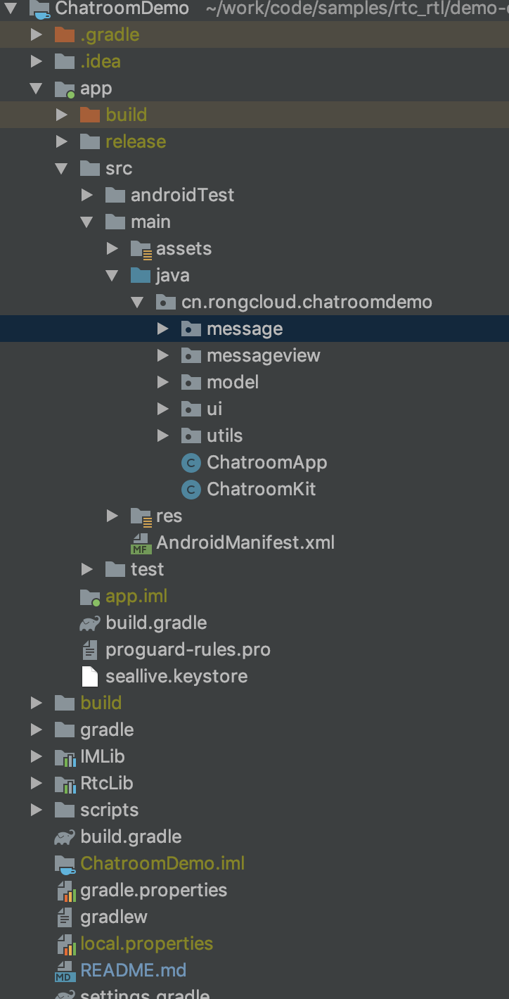
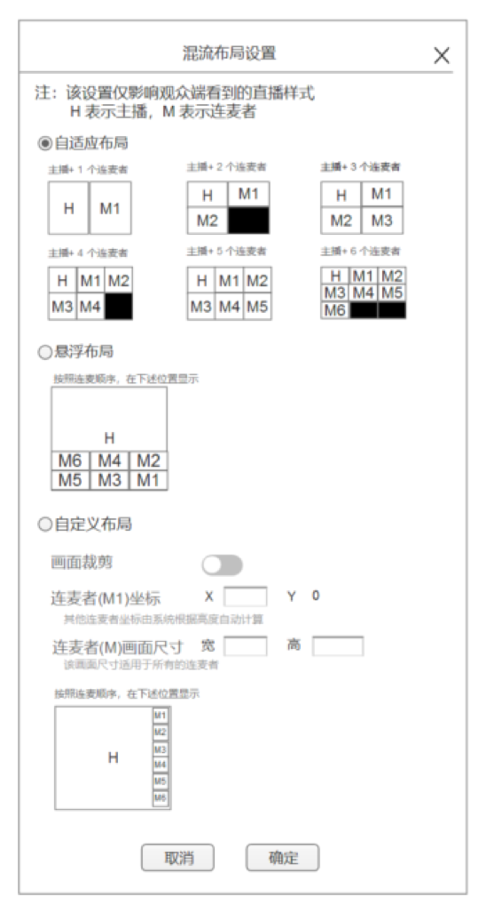

# SealLive-Android
本文档介绍了 SealLive 的整体框架设计和核心流程，为开发者了解 SealLive 的主要功能提供指导性说明。体验 [SealLive](https://www.rongcloud.cn/downloads/demo)。

### 产品简介
SealLive 是以融云 IM、音视频服务为基础，实现在线直播类型产品。 主要提供了在线直播、观众上麦下麦、实时消息等功能。*（注意:  SealLive 直播间的消息是基于融云IM 聊天室开发的，由于 SealLive 主要是用于演示功能，所以 SealLive 在创建直播间后如果一小时之内没人发言则会自动解散当前聊天室，如果您需要聊天室长时间保活，可以咨询融云客服，启用保活聊天室功能即可）*

### 快速开始
1. [注册融云开发者](https://developer.rongcloud.cn/signup/?utm_source=demogithub&utm_term=demosign)，创建应用后获取 APPKey。
2. 开通音视频服务。
3. 部署 [SealLive-Server](https://github.com/rongcloud/demo-chatroom/tree/v2.0/app-server)
4. 服务部署完毕之后，请分别将源码中的 `APPKey`,`BuglyKey`,`APPSERVER` 改为您自己的
参见源码中文件  `DataInterface.java`
5. 运行 Android 项目  `client-android/ChatroomDemo`

### 功能模块介绍
SealLive-Android 代码目录是由 message、messageview、model、ui、utils、ChatroomKit、ChatroomApp 等模块组成

* **message：**  邀请上麦、进入直播间、点赞等自定义消息信令
* **messageview：** 自定义消息展示View
* **model：**  礼物信息、角色信息、房间信息等数据模型
* **ui：**  自定义 UI 组件和各个界面的Activity，其中包括：
  * **LiveListActivity:** 直播列表界面
  * **CreateLiveRoomActivity:**  创建直播间界面
  * **RoomInfoActivity:** 直播详情页
* **utils：** 通用的一些工具类,其中 **DataInterface.java**  保存了直播功能中所有用到的数据接口和 AppKey 等信息
* **ChatroomKit：** 对融云 IM 引擎的封装方便调用
### 产品角色信息介绍

SealLive 中有三种用户角色:
* **主播** 当前直播间的创建者，可以进行发布音视频资源、邀请观众上麦、查看观众列表、设置混流布局模式等操作。
* **观众** 进入直播间后用户的默认角色。可以进行订阅观看直播、发布文字评论及礼物、点赞等操作。
* **连麦者** 是由主播邀请上麦的观众被称为连麦者，可以进行发布音视频资源并和主播进行连麦。

### SealLive操作流程

> 在执行所有流程之前，都应先调用 **RongIMClient.init(context, appKey)** 接口初始化 IM，并调用 **RongIMClient.connect(token, callback)** 接口连接 IM,详细 IM 集成方法可以参考[融云官方文档](https://docs.rongcloud.cn/im/imlib/android/quick-start/init/)

##### 主播创建房间发布资源操作流程
1. 主播端首先调用 **RongRTCEngine#joinRoom** 接口创建一个直播类型房间。
2. 创建直播类型房间成功后，调用 **RongRTCLocalUser#publishDefaultLiveAVStream** 接口发布音视频资源。
3. 音视频资源发布成功后会返回一个 **RongRTCLiveInfo** 对象，对象中包含了 RoomId、直播地址(liveUrl)等信息，将以上信息上传到自己的 APPServer ，至此主播已创建好一个直播间等待观众端的加入。
4. APPServer在收到上传的直播信息后保存并刷新直播列表。
5. 通过由 APPServer 拿到的直播地址和直播类型，调用 **RongRTCEngine#subscribeLiveAVStream** 接口开始观看直播。
6. 观众端停止观看直播，调用 **RongRTCEngine#unsubscribeLiveAVStream** 接口取消观看直播。
7. 主播端停止发布并退出，调用 **RongRTCEngine#quitRoom** 接口退出聊天室。

##### 多主播连麦操作流程
1. 参照上面**主播创建房间发布资源操作流程** 的前3步实现 主播端可以创建一个主播间，并发布资源；观众端可以订阅直播资源； 
2. 连麦前还需要主播端进行创建 IM 聊天室：主播端调用 **RongIMClient#joinChatRoom** 接口创建 IM 聊天室。 获取 IM聊天室房间 Id （如果聊天室房间 ID 和直播房间RoomId为同一个则可以忽略）后上传到自己的 APPServer
3. 观众端通过 APPServer 拿到直播信息后，首先调用 **RongIMClient#joinChatRoom** 接口加入到由主播创建的 IM 聊天室。
4. 主播端需要连麦操作时，应先通过自己的 APPServer 获取当前聊天室内所有用户的列表，获取指定上麦用户的 ID ，并构建一条连麦的自定义消息，调用 **RongIMClient#sendMessage** 接口将自定义消息发送给对应的用户。
5. 对端用户收到连麦的自定义消息后，应先调用 **RongRTCEngine#unsubscribeLiveAVStream** 接口取消观看直播。
6. 取消观看直播后，调用 **RongRTCEngine#joinRoom** 接口加入到直播房间升级为连麦者。
7. 升级为连麦者后，调用 **RongRTCRoom#publishDefaultLiveAVStream** 接口来发布资源。
8. 主播端如果想要执行取消连麦操作，先获取指定取消连麦用户的 ID,并构建一条取消连麦的自定义消息，调用 **RongIMClient#sendMessage** 接口将自定义消息发送给对应的用户。
9. 连麦者用户收到取消连麦的自定义消息后，应调用 **RongRTCEngine#quitRoom** 接口取消发布资源。

##### 合流布局设置操作流程

1. 主播端调用 **RongRTCLocalUser#publishDefaultLiveAVStream** 接口发布音视频资源，通过回调接口获得 **RongRTCLiveInfo** 对象。
2. 通过调用 **RongRTCLiveInfo#setMixConfig** 接口来设置合流布局模式，合流布局包含三种模式： 自适应布局(默认)、悬浮布局、自定义布局。（关于合流布局的详细说明可以参考[官方文档](https://docs.rongcloud.cn/rtc/rtclib/android/video_mix_layout/)）

### 使用到的融云产品
* **即时通讯 IMLib SDK**  可详细查看 [IMLib SDK 开发指南](https://www.rongcloud.cn/docs/android.html)
* **音视频 RTC SDK** 可详细查看 [RTC SDK 开发指南](https://www.rongcloud.cn/docs/android_rtclib.html)

